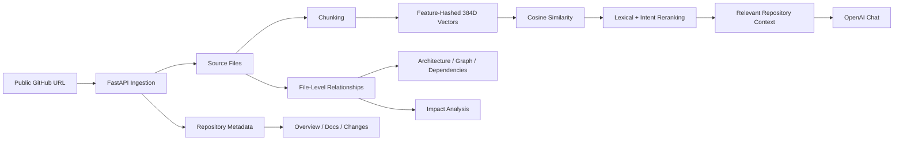

<div align="center">

# Codebase Intelligence

### Understand any codebase. See the system behind it.

A full-stack platform for exploring public GitHub repositories through architecture views, file relationships, retrieval, impact analysis, documentation, and codebase-aware AI chat.

<p>
  <a href="https://codebase-intelligence-platform-sand.vercel.app/"><strong>Live Demo</strong></a>
  &nbsp;•&nbsp;
  <a href="https://github.com/PrayagSingh9A7/codebase-intelligence-platform"><strong>GitHub</strong></a>
</p>

<p>
  
  
  
  
  
  
</p>

</div>

---

## ✦ Why this project?

Reading an unfamiliar codebase often means jumping between files, tracing imports, guessing architecture, and searching manually for the right context.

**Codebase Intelligence** turns that exploration into a single workflow:

> **Paste a public GitHub URL → ingest the repository → analyze its structure → retrieve relevant code → explore relationships → ask questions.**

The goal is to make a repository feel less like a folder of files and more like an explorable system.

---

## ✨ Product Highlights

<table>
<tr>
<td width="50%">

### 🧭 Repository Analysis

- Public GitHub repository ingestion
- Repository metadata and branch information
- File and language analysis
- Entry-point detection
- File-level relationship mapping

</td>
<td width="50%">

### 🔎 Code Retrieval

- Fixed-window code chunking
- 384-dimensional feature-hashed vectors
- NumPy cosine similarity search
- Lexical + intent-aware reranking
- Repository-local context for answers

</td>
</tr>
<tr>
<td width="50%">

### 🤖 GenAI Workspace

- OpenAI-powered codebase chat
- Repository-aware answers
- File summaries
- Documentation generation
- Deterministic fallback path

</td>
<td width="50%">

### 📊 System Exploration

- Architecture workspace
- Dependency exploration
- Impact analysis
- System-flow view
- 3D repository topology
- Commit-to-commit change view

</td>
</tr>
</table>

---

## 🖥️ Experience

### Landing / Ingestion

Paste a public GitHub repository and start analysis from the same workspace.

```text
┌──────────────────────────────────────────────────────────────────────┐
│  CODEBASE INTELLIGENCE                                               │
│  Understand any codebase.                                            │
│  See the system behind it.                                           │
│                                                                      │
│  https://github.com/owner/repository    [ Analyze repository ]       │
│                                                                      │
│  Public repo ingestion   Import-aware graph   Embeddings + retrieval │
└──────────────────────────────────────────────────────────────────────┘
```

### Workspace

```text
┌───────────────┬──────────────────────────────────────────────────────┐
│ WORKSPACE     │  OVERVIEW                                             │
│               │                                                       │
│ Overview      │  Files indexed   Graph nodes   Relationships         │
│ Architecture  │  ┌──────────┐    ┌──────────┐   ┌──────────────┐     │
│ Graph         │  │   60     │    │   21     │   │      1       │     │
│ Dependencies  │  └──────────┘    └──────────┘   └──────────────┘     │
│ Impact        │                                                       │
│ Flows         │  Repository profile       Detected technology stack  │
│ Chat          │  ───────────────────      ─────────────────────────  │
│ Docs          │  metadata • branch       frameworks • databases      │
│ Changes       │                                                       │
└───────────────┴──────────────────────────────────────────────────────┘
```

> Replace the mock blocks above with actual screenshots in `docs/screenshots/` for the final repository presentation.

---

## 🧠 How it works



### Request flow

1. **Ingest** — fetch repository metadata and source files through the GitHub API.
2. **Analyze** — inspect languages, entry points, files, and supported import relationships.
3. **Index** — split source into chunks and build lightweight 384-dimensional feature-hashed vectors.
4. **Retrieve** — rank repository-local candidates using cosine similarity followed by lexical/intent signals.
5. **Generate** — send the selected repository context to OpenAI for codebase-aware responses.
6. **Explore** — render the same analysis through architecture, graph, dependency, impact, flow, documentation, and change views.

---

## 🏗️ Architecture

```text
                          ┌─────────────────────────┐
                          │       Next.js Web        │
                          │  TypeScript + R3F UI     │
                          └────────────┬────────────┘
                                       │ REST
                                       ▼
                          ┌─────────────────────────┐
                          │      FastAPI API        │
                          │       Python            │
                          └────────────┬────────────┘
                                       │
              ┌────────────────────────┼────────────────────────┐
              │                        │                        │
              ▼                        ▼                        ▼
      ┌───────────────┐       ┌────────────────┐       ┌────────────────┐
      │   GitHub API  │       │ Retrieval Layer │       │   OpenAI API   │
      │   Repo Data   │       │ chunk + rank    │       │ AI responses   │
      └───────────────┘       └────────────────┘       └────────────────┘
              │                        │
              └──────────────┬─────────┘
                             ▼
                    ┌─────────────────────┐
                    │ Repository Workspace │
                    │ graph • files • docs │
                    └─────────────────────┘
```

---

## 🛠️ Tech Stack

### Frontend

| Technology | Role |
|---|---|
| **Next.js** | Full-stack React framework for the web UI |
| **TypeScript** | Type-safe application development |
| **React Three Fiber** | Interactive 3D repository topology |
| **Lucide React** | Interface icons |
| **CSS** | Glassmorphism, responsive layout, workspace styling |

### Backend

| Technology | Role |
|---|---|
| **Python** | Analysis and service layer |
| **FastAPI** | REST API |
| **NumPy** | Vector math and cosine similarity |
| **SQLite** | Local application/auth persistence |
| **GitHub API** | Repository ingestion and metadata |
| **OpenAI API** | Generative codebase chat and summaries |

### Deployment

| Layer | Platform |
|---|---|
| Frontend | Vercel |
| Backend | Render |
| Source | GitHub |

---

## 🔐 Authentication & Security

The application includes email/password authentication with:

- PBKDF2-SHA256 password hashing
- Per-user salts
- Bearer session tokens
- Profile management and logout
- Explicit CORS origin configuration

### Environment variables

Create a backend `.env` file for local development:

```env
OPENAI_API_KEY=your_openai_api_key
OPENAI_MODEL=your_model_name
GITHUB_TOKEN=your_github_token
WEB_ORIGIN=http://localhost:3000
```

For deployment, configure the same secrets in the backend hosting environment rather than committing them to Git.

---

## 🚀 Local Development

### 1. Clone

```bash
git clone https://github.com/PrayagSingh9A7/codebase-intelligence-platform.git
cd codebase-intelligence-platform
```

### 2. Backend

```bash
cd apps/api
python -m venv .venv
```

**Windows**

```powershell
.\.venv\Scripts\Activate.ps1
```

Install dependencies:

```bash
pip install -r requirements.txt
```

Start FastAPI:

```bash
uvicorn app.main:app --reload --port 8000
```

API docs:

```text
http://localhost:8000/docs
```

### 3. Frontend

```bash
cd ../../apps/web
npm install
npm run dev
```

Open:

```text
http://localhost:3000
```

Set the frontend environment variable:

```env
NEXT_PUBLIC_API_URL=http://localhost:8000
```

---

## 📡 Core API Surface

| Endpoint | Purpose |
|---|---|
| `POST /api/repos/analyze` | Analyze a public GitHub repository |
| `POST /api/chat` | Ask repository-aware questions |
| `POST /api/files/summary` | Generate a file summary |
| `POST /api/impact` | Analyze impact around a target |
| `POST /api/auth/signup` | Create an account |
| `POST /api/auth/login` | Authenticate a user |
| `GET /api/auth/me` | Read the active profile |
| `PUT /api/auth/profile` | Update profile information |
| `POST /api/auth/logout` | End a session |

---

## 📌 What the analyzer currently understands

The current implementation focuses on **file-level repository intelligence** rather than full compiler-grade semantic analysis.

It can currently:

- ingest public repositories through the GitHub API
- inspect repository metadata and languages
- detect common entry-point filenames
- build supported file-level import relationships
- chunk source code for retrieval
- rank repository-local code context
- generate answers through OpenAI
- provide a deterministic fallback path when an LLM response is unavailable
- surface architecture, dependencies, impact, flows, documentation, and changes in one workspace

This keeps the README aligned with the current implementation rather than claiming unsupported AST, symbol-graph, or vector-database functionality.

---

## 🎯 Design Principles

**One repository, one workspace**  
All views are driven from the same analysis result so the user does not have to repeatedly inspect separate tools.

**Repository-first context**  
The repository itself is treated as the source of truth for exploration and chat.

**Fast visual feedback**  
The interface is designed around cards, graphs, topology, and focused navigation rather than raw API output.

**Graceful fallback**  
The platform has deterministic fallback behavior for AI-dependent flows instead of making the entire workspace unusable when model access is unavailable.

---

## 🔭 Roadmap

The next engineering upgrades for the intelligence layer are:

- Tree-sitter based parsing for JavaScript, TypeScript, and Python
- robust `../` and alias-aware module resolution
- AST-aware chunks with line-level citations
- real semantic embeddings plus BM25/FTS retrieval
- reciprocal-rank fusion and retrieval evaluation with recall@k / MRR
- repository indexes keyed by repository and commit SHA
- persistent vector/index storage
- smarter large-repository ingestion and prioritization
- deeper impact analysis using reverse dependency traversal
- graph filtering, zooming, and click-to-code exploration
- background ingestion jobs and progress reporting
- stronger automated tests and CI

---

## 📈 Project Positioning

Codebase Intelligence is designed as a **portfolio-grade full-stack GenAI engineering project** combining:

- web engineering
- backend API design
- GitHub integration
- information retrieval
- generative AI
- authentication
- 3D data visualization
- cloud deployment

The project deliberately keeps the analysis pipeline visible and inspectable rather than hiding everything behind a single LLM call.

---

## 🔗 Links

- **Live:** https://codebase-intelligence-platform-sand.vercel.app/
- **Repository:** https://github.com/PrayagSingh9A7/codebase-intelligence-platform
- **Backend:** https://codebase-intelligence-platform-ukxw.onrender.com

---

<div align="center">

### Built by Prayag Singh

**Next.js · TypeScript · FastAPI · Python · OpenAI · NumPy · React Three Fiber**

</div>
